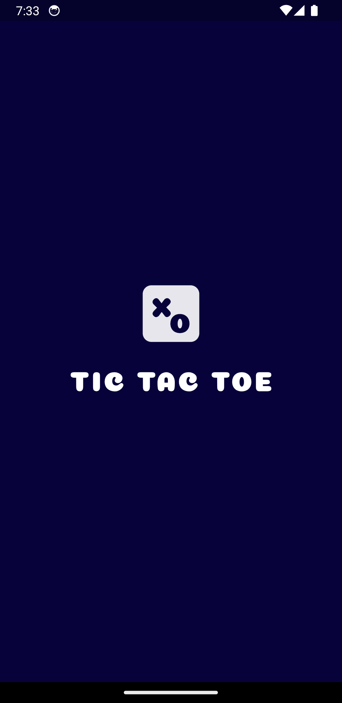

# Flutter Tic Tac Toe

Flutter Tic Tac Toe is a simple mobile application developed using the Flutter framework. It allows two players to play the classic Tic-Tac-Toe game on their mobile devices.

## Features

- **Two Player Mode:** Play against a friend on the same device.
- **Simple Interface:** Clean and intuitive UI design for easy gameplay.
- **How to Play:** Know how to play the game before stating to play.
- **Win Detection:** Automatically detects winning combinations and declares the winner.
- **Draw Detection:** Detects when the game ends in a draw.
- **Reset Option:** Option to reset the game board and start a new game.
- **Restart Option:** Option to restart the game and start a new game.

## Screenshots

